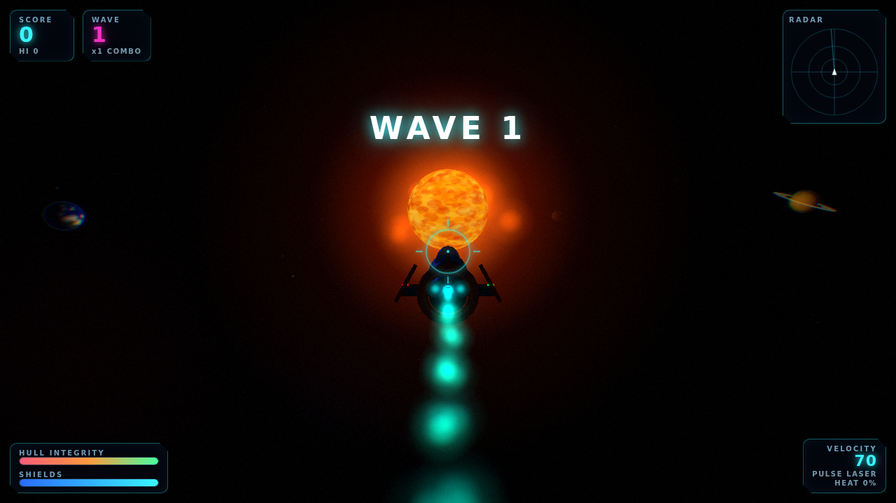

# 🚀 Cosmos Explorer

A browser-based **3D arcade flight-shooter** built with [three.js](https://threejs.org/).
Fly a futuristic rocket ship through our solar system, weave between glowing planets and
a blazing sun, and blast waves of alien invaders for score. Runs on **desktop, iPhone/
mobile, and with an Xbox controller** — no install, no build step.



## 📡 The Bonkers Blurb™ (as seen on Hallucinated Takes)

> STOP scrolling. The Sun is ON FIRE — not metaphorically, LITERALLY, we
> hand-simulated every roiling plasma granule and it is FURIOUS — and it wants you
> to fly directly into it at seventy arbitrary units per second. **COSMOS EXPLORER**
> is a 3D space shooter that boots in your browser in the time it takes to blink,
> loads NOTHING from a server, and immediately hands you a chrome rocket with the
> aerodynamic profile of pure attitude.
>
> You will fly. In ALL directions. Yes, *up*. Yes, *the other up*. Barrel-roll past
> a ringed gas giant like you pay rent there. Then the aliens arrive: neon **scouts**
> that swarm like caffeinated wasps, **fighters** that circle-strafe with the smug
> confidence of a parallel-parking expert, and **cruiser** saucers — flying dinner
> plates of pure menace that soak up lasers and drop loot when they finally, gloriously,
> *pop* into a bloom-lit fireball with a shockwave ring and a camera shake you'll feel
> in your DENTAL WORK.
>
> Chain kills. Watch the combo multiplier climb like a stock you don't understand.
> Overheat your pulse laser and feel *shame*. Collect a shield cell and feel like a GOD.
> There is a radar. There is a lock-on reticle. There is a film-grain-and-chromatic-
> aberration color grade so cinematic you'll check your reflection for a director's chair.
>
> Works on your laptop. Works on your iPhone with a virtual joystick. Works with an
> Xbox controller because we RESPECT you. No install. No launcher. No "create an account
> to continue." Just a rocket, a solar system, and a truly unreasonable number of
> explosions.
>
> **Cosmos Explorer. The Sun started it. You finish it.** 🚀☀️💥
>
> <sub>(Built with three.js and vanilla ES modules. No engine. No build step. Absolutely
> no chill.)</sub>

## Features

- **Full 3D solar system** — a bloom-lit sun with a layered corona, six orbiting
  planets (banded gas giants, a ringed world, an ocean planet), a 5,000-star field and
  drifting nebula clouds, all generated procedurally in code (zero texture downloads).
- **Three alien ship types**, each with distinct models and AI:
  - **Scout** — fast, fragile, swarms you.
  - **Fighter** — circle-strafes and fires often.
  - **Cruiser** — slow, tanky flying saucer that hits hard and drops loot.
- **Boss fights** — every 5th wave a giant **Mothership** warps in with a dedicated
  health bar, orbiting at range while it unleashes bolt fans and summons escorts. Down
  it for a huge score, a cascade of explosions and a pile of guaranteed loot.
- **Two weapons** — a **pulse laser** that upgrades through three levels (adding spread
  barrels and a faster fire rate) and **homing missiles** that lock onto your target and
  detonate in an area blast.
- **Juicy combat VFX** — additive particle explosions with debris, expanding shockwave
  rings, flash sprites, dynamic lights, camera shake, floating score popups, killstreak
  callouts (TRIPLE! / RAMPAGE! / GODLIKE!) and an `UnrealBloom` post pipeline plus a
  cinematic color-grade (vignette, chromatic aberration, film grain).
- **A futuristic HUD** — animated score counter, wave & combo tracker, hull/shield bars,
  velocity + weapon heat, weapon level, missile count, a live **radar**, a target
  **lock-on** reticle, toast messages and a damage vignette.
- **Wave progression & scoring** — escalating enemy waves, a combo multiplier and
  killstreaks that reward fast chained kills, collectible power-ups (hull repair, shield
  cells, weapon upgrades, missile resupply, score bonuses) and a persistent high score.
- **Quality of life** — pause (Esc / Start / on-screen button) and mute, with full
  cross-platform controls.
- **Procedural audio** — an adaptive synth **soundtrack** (pad, bassline, arpeggio) that
  turns dark and driving during boss fights and ducks when paused, plus engine drone,
  lasers, explosions and UI stings — all synthesized with the Web Audio API (no files).
- **Universal controls** — mouse + keyboard, touch (virtual joystick + fire/boost
  buttons), and Xbox / standard gamepad, all merged through one input layer.

## Controls

| Action           | Desktop                   | Gamepad (Xbox)      | Mobile              |
|------------------|---------------------------|---------------------|---------------------|
| Steer / aim      | Mouse                     | Left stick          | Left joystick       |
| Throttle / brake | `W` / `S`                 | D-pad up / down     | (auto-cruise)       |
| Roll             | `Q` / `E`                 | Bumpers `LB`/`RB`   | (auto-banks)        |
| Fire             | Left click / `Space`      | `RT` or `A`         | **FIRE** button     |
| Boost            | `Shift`                   | `LT` or `B`         | **BOOST** button    |

The ship always cruises forward along its nose; you steer the heading and blast anything
in front of you. The crosshair shows where you'll shoot; a red reticle locks onto the
nearest target in your sights.

## Running it

Because the game uses native ES modules, it must be served over HTTP (opening
`index.html` directly via `file://` won't load the modules). Any static server works:

```bash
# Python
python3 -m http.server 8080

# …or Node
npx http-server -p 8080

# …or the VS Code "Live Server" extension
```

Then open **http://localhost:8080** and hit **LAUNCH**. Best played fullscreen with
sound on. On iPhone, add it to your Home Screen for a fullscreen, chrome-free experience.

## Tech notes

- **No build tooling.** Plain ES modules + an [import map](https://developer.mozilla.org/en-US/docs/Web/HTML/Element/script/type/importmap).
- **three.js is vendored** under [`vendor/three/`](vendor/three) (build + the handful of
  postprocessing addons used), so the game is fully self-contained and works offline.
  To upgrade, replace the files there and update the import map in `index.html`.
- **Performance:** object pooling for every projectile, explosion and pickup (no per-frame
  allocation churn); the renderer caps device-pixel-ratio and dials back bloom/antialias
  on touch and low-core devices.

## Project layout

```
index.html            Entry point + import map + HUD / menu markup
styles.css            Neon HUD, menus, touch controls
vendor/three/         Vendored three.js (build + postprocessing addons)
src/
  main.js             Bootstrap + error surface
  Game.js             Renderer, bloom, camera, game loop, collisions, state
  SolarSystem.js      Sun, planets, rings, starfield, nebula
  Player.js           Rocket ship model, flight physics, weapon, exhaust trail
  AlienManager.js     Alien ship types, AI, wave spawning
  Projectiles.js      Pooled laser bolts (player + enemy)
  ExplosionManager.js Pooled particle explosions + shockwaves
  Pickups.js          Collectible power-ups
  HUD.js              DOM HUD + radar canvas
  Input.js            Unified keyboard / mouse / touch / gamepad
  Audio.js            Procedural Web Audio SFX
  utils.js            Small shared helpers
```

## License

MIT — have fun, remix it, ship your own space adventure. three.js is © its authors under
the MIT license.
